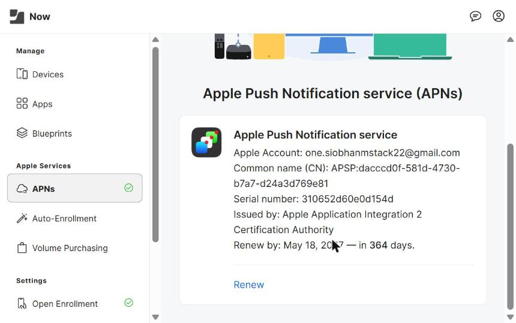
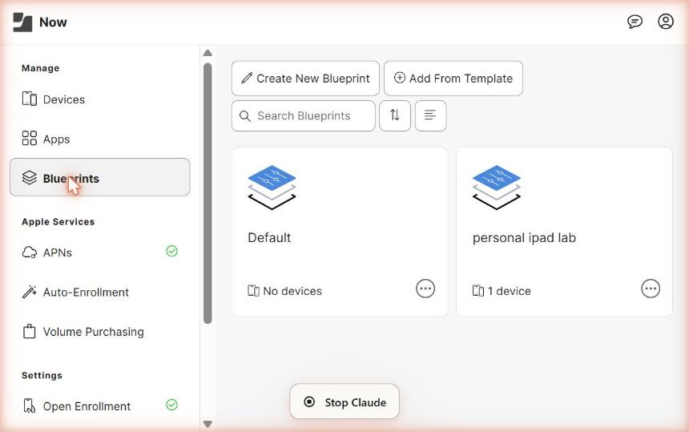
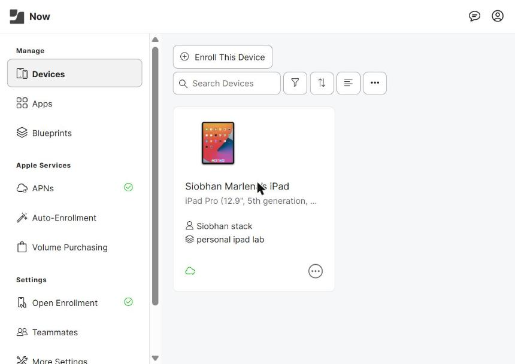

# Jamf MDM Lab - Secure iPad Workstation

## Project Overview

This lab project demonstrates how to set up a Mobile Device Management (MDM) environment using Jamf Now. The goal was to configure a secure iPad workstation with remote management capabilities, including passcode enforcement, app restrictions, and over-the-air device control.

**Tools Used:** Jamf Now, Apple Push Certificates Portal, iPadOS Safari

**Device Enrolled:** iPad Pro (12.9", 5th generation)

---

## Phase 1 - Connect Jamf Now to Apple (APNs Certificate)

Jamf requires an Apple Push Notification service (APNs) certificate to communicate securely with enrolled devices.

Steps completed:
- Downloaded the Certificate Signing Request (CSR) from Jamf Now
- - Signed in to the Apple Push Certificates Portal
  - - Created a new certificate and uploaded the CSR
    - - Downloaded the resulting .pem certificate file
      - - Uploaded the .pem file back to Jamf Now and saved
       
        - **Result:** APNs connection established and verified (active certificate issued by Apple Application Integration 2 Certification Authority, valid for 1 year)
       
        - 
       
        - ---

        ## Phase 2 - Create and Configure a Blueprint

        A Blueprint is the policy template that defines security settings applied to enrolled devices.

        Steps completed:
        - Navigated to Blueprints in the left sidebar
        - - Created a new Blueprint named "personal ipad lab"
          - - Configured the Passcode tab: enabled "Require passcode" with a minimum of 6 digits
            - - Configured the Restrictions tab: disabled the camera as a visual test of policy enforcement
             
              - **Result:** Blueprint created and assigned to 1 device
             
              - 
             
              - ---

              ## Phase 3 - Activate Open Enrollment

              Open Enrollment creates a secure web portal that allows devices to self-enroll without requiring IT to physically handle each device.

              Steps completed:
              - Navigated to Settings > Open Enrollment
              - - Toggled enrollment to Enabled
                - - Set an Access Code to prevent unauthorized enrollment
                  - - Selected "personal ipad lab" as the default Blueprint
                    - - Copied the unique enrollment URL
                     
                      - **Result:** Open Enrollment active with a custom access code and blueprint assignment
                     
                     
                      - ---

                      ## Phase 4 - Enroll the iPad

                      Steps completed:
                      - Opened Safari on the iPad and navigated to the enrollment URL
                      - - Entered the access code
                        - - Tapped Allow when prompted to download the configuration profile
                          - - Opened Settings on the iPad and installed the downloaded profile
                            - - Tapped Trust on the Remote Management prompt to finalize enrollment
                             
                              - **Result:** iPad appeared in the Jamf Now device inventory under the "personal ipad lab" blueprint
                             
                              - 
                             
                              - ---

                              ## Phase 5 - Test and Verify Remote Commands

                              Steps completed:
                              - Confirmed the iPad appeared in the Devices dashboard
                              - - Observed that the Camera app disappeared from the iPad home screen (confirming the Blueprint restriction applied)
                                - - Sent a remote Lock Device command from the Jamf Now dashboard
                                  - - Watched the iPad screen turn off and lock instantly over the air
                                   
                                    - ---

                                    ## Skills Demonstrated

                                    - Mobile Device Management (MDM) configuration
                                    - - Apple Push Notification service (APNs) certificate setup
                                      - - Security policy creation and enforcement via Blueprints
                                        - - Over-the-air device enrollment and remote management
                                          - - Jamf Now administration
